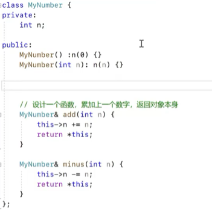
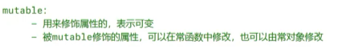
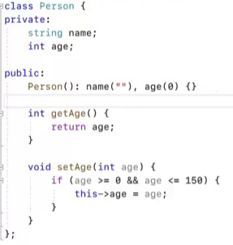
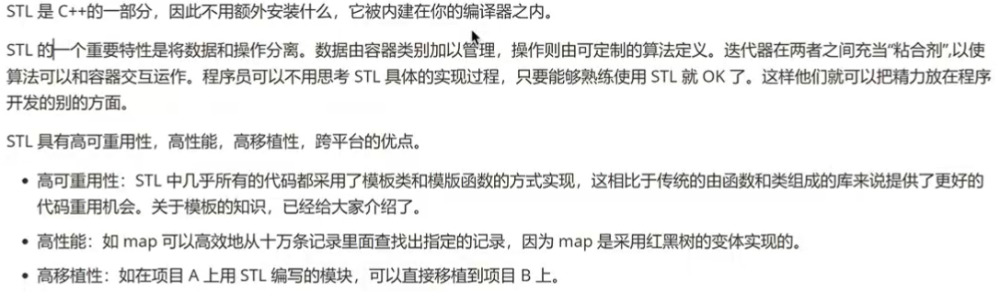

## C++基础

### 基础知识

- 原码反码补码


- 在VS的一个项目中只能保留一个main函数。
- 浮点型注意事项


- 布尔型注意事项


- 字符数据类型


- 数据类型转换


- 控制台输入


- 命名空间


- 运算符


### 函数

- 同名的.cpp文件和.h文件是相关联的，.h文件里面只需要写函数声明，.cpp文件中负责具体的实现。要想调用其他文件中定义的函数，需要include "xxx.h"。

- 在调试中，逐语句会一条一条执行，遇到函数调用会进入该函数；逐过程也是一条一条执行，但遇到函数调用不会进入该函数；跳出会直接跳转到下一个断点。

### 指针与引用

- 内存可以分为：栈区、堆区、全局区、代码区

1.代码区


2.全局区


3.栈区


4.堆区


- 常量指针与指针常量


- 引用


### 数组

- 浅拷贝与深拷贝


### 面向对象基础

- 访问权限


- 对象的创建


- 对象占用空间的大小

1.使用sizeof计算类对象所占空间大小
对类做sizeof运算时，并不是简单地把各个成员所占的内存数量相加。需要注意成员顺序不同，可能需要字节补齐。

``` c++
class C { 
        char c; 
        int int1; 
        int int2; 
        int i; 
        long l; 
        short s; 
};
```

这个类的大小是24字节。尽管char c只消耗1个字节，但将为它分配4个字节，剩下的3个字节将被浪费（留空）。这是因为下一个成员是int，它占用4个字节。如果我们不进入下一个（4）字节来存储这个整数成员，那么这个整数的内存访问/修改周期将是2个读周期。所以编译器会为我们做这个补位。short也是同理，由2字节补至4字节。

2.使用sizeof计算含有虚函数的类对象的空间大小
虚函数的存在将在类中添加4个字节的虚拟表指针，这将被添加到类的大小。 同样，在这种情况下，如果类的基类已经直接或通过其基类具有虚函数，那么这个额外的虚函数将不会添加任何类的大小。 虚拟表指针在类层次结构中是通用的。
普通函数不占用内存。
只要有虚函数就会占用一个指针大小的内存，原因是系统多用一个这镇维护这个类的虚函数表。

3.使用sizeof计算虚拟继承的类对象的空间大小
在C++中，有时由于某些原因，我们不得不使用虚拟继承。当我们使用虚拟继承时，在该类中，虚拟基类指针将会有4个字节的开销。

4.空类的大小不为零，一般是1个字节。确保两个不同的对象具有不同的地址是非零的。

- static

静态成员


- 构造函数
  


关键字explicit


构造函数初始化列表

拷贝构造函数


- 析构函数
  


- 浅拷贝与深拷贝
  

  

  

如果是浅拷贝，那么Cat* pet指向的是同一块内存，在析构时会导致Cat* pet多重释放从而出问题。

- this 指针
  


this 指针还可以用于设计函数返回对象本身


返回值类型是引用：返回对象的引用
返回值类型直接是类对象：返回的是对象的副本。所以用引用会效率高一些，不用拷贝

- 常函数
  


- 常对象
  

- 关键字mutable
  

- 友元
  

1. 全局函数做友元
   

2. 成员函数做友元
   

先声明class Home的原因是class GoodFriend中有成员Home* home

3. 友元类
   

- 运算符重载
  
  
  
  
  
  默认的拷贝构造函数和 = 都是浅拷贝，下面是替换为深拷贝。
  
  

### 封装，继承，多态

- 封装
  
  

- 继承的基础语法
  
  

- 继承的特点
  
  

- 三种继承方式
  

- 继承中的构造函数和析构函数
  
  

- 父类和子类有同名成员
  
  

- 多继承
  
  

- 菱形继承
  

此情况下Mule中会有两个age，出现命名冲突。

- 多态的基本概念
  

- 对象转型
  
  
  

- 虚函数与重写


- 纯虚函数与抽象类
  
  

- 纯虚函数与多继承
  
  

- 虚析构函数
  
  
  

- 结构体
  

### 模板

- 模板介绍
  

- 函数模板定义
  
  
  
  虚拟类型可以有默认值，也可以根据参数类型进行推导。
  
- 函数模板调用
  
  

- 类模板
  
  

- 类模板继承
  

- 模板类头文件和源文件
  

### STL

- STL简介
  
  
  

- 容器、算法、迭代器
  
  
  

- string容器
  

## 知识点总结

- 默认情况下class的成员是private私有的，struct的成员是public的。这是struct和class的唯一区别。


- 关于const函数


函数前const：普通函数或成员函数（非静态成员函数）前均可加const修饰，表示函数的返回值为const，不可修改【修饰的是函数返回值】

```c++
const returnType functionName(param list)
```

函数后加const：只有类的非静态成员函数后可以加const修饰，表示该类的this指针为const类型，不能改变类的成员变量的值，即成员变量为read only，任何改变成员变量的行为均为非法。此类型的函数可称为【只读成员函数，也称作类的常成员函数】

```c++
returnType functionName(param list) const
```

- 类的静态成员 static member 变量全局只有一份副本，不会随着类对象的创建而产生新的副本。main函数开始执行之前，静态数据初始化就已经完成过了。


```cpp
#include <iostream>
using namespace std;
struct MyStruct {
    // 下面的这条初始化语句等价于下面的两条语句：
    //（1）ider= ider+ 1; 
    //（2）id = ider;
    MyStruct() :id(++ider)
   {
    }

    int id;
    static int ider;//将
};

int MyStruct::ider = 0;
//(0) main函数开始执行之前
int main()
{
    //(1)创建对象my1，执行完下面这条语句之后，MyStruct::ider== 1, my1.id == 1 
    MyStruct my1;//(1)
    //(2)创建对象my2，执行完下面这条语句之后，MyStruct::ider== 2, my1.id == 2 
    MyStruct my2;//(2)
    //(3)创建对象my3，执行完下面这条语句之后，MyStruct::ider== 3, my1.id == 3 
    MyStruct my3;//(3)

    //my1.increaser和MyStruct::increaser是同一个变量
    //，只不过一个是通过对象访问，一个是通过类名访问
    cout << my1.id << " " << MyStruct::ider<< endl;
    cout << my2.id << " " << MyStruct::ider<< endl;
    cout << my3.id << " " << MyStruct::ider<< endl;

    return 0;
}
```

输出：

```text
1 3
2 3
3 3
```

- 


```cpp
string s("I love you.");
// s.size() 的值是 11。 和 C字符串不同，C++字符串最后没有 '\0'
```

- 值语义就是赋值语句执行之后，两个变量没有任何关系，各自是独立的。对象默认也是值语义的，标准库STL的容器都是值语义的。

```cpp
int a = 0;
int b = 1;

a = b; // a 和 b 仅仅是值相同，实际上是两个没有任何关系的变量。有各自的内存地址。
```

将一个变量放进容器，实际上是把变量的值传给容器，容器在内部创建一个同类型的变量，并赋值为传入的值。

```cpp
#include <iostream>
#include <vector>
using namespace std;
 
int main()
{
	int a = 4;
 
	vector<int> arr;
	arr.push_back(a);//a并没有进入容器，a的副本在容器里被创建了出来
 
	a = 5;
 
	cout<<arr.back()<<endl;//输出4，不会输出5
 
	return 0;
}
```

- 函数指针


https://blog.csdn.net/weixin_50866517/article/details/113247374

- C++初始化

1.默认初始化

默认初始化是指定义变量时没有指定初值时进行的初始化操作。例如int a; Sales_data myData;等等。这些变量被定义了而不是仅仅被声明（因为没有extern关键字修饰），而且没有显式的赋予初值。特别的，如果采用动态分配内存的方式（即采用new关键字）创建的变量，不加括号时（如int *p=new int;）也是默认初始化，加了括号（如int *p=new int()）为值初始化。变量的值与变量的类型与定义的位置有关系。

（1）对于内置类型变量（如int，double，bool等），如果定义在语句块外（即{}外），则变量被默认初始化为0；如果定义在语句块内（即{}内），变量将拥有未定义的值。

（2）对于类类型的变量（如string或其他自定义类型），不管定义于何处，都会执行默认构造函数。如果该类没有默认构造函数，则会引发错误。因此，建议为每个类都定义一个默认构造函数（=default）。

2.值初始化

值初始化是值使用了初始化器（即使用了圆括号或花括号）但却没有提供初始值的情况。例如，int *p=new int();vector vec(10);等等都是典型的值初始化方式。注意，当不采用动态分配内存的方式（即不采用new运算符）时，写成int a();是错误的值初始化方式，因为这种方式声明了一个函数而不是进行值初始化。如果一定要进行值初始化，必须结合拷贝初始化使用，即写成int a=int();值初始化和默认初始化一样，对于内置类型初始化为0，对于类类型则调用其默认构造函数，如果没有默认构造函数，则不能进行初始化。

3.直接初始化与拷贝初始化

直接初始化与拷贝初始化对应，其内部实现机理不同。直接初始化是指采用小括号的方式进行变量初始化（小括号里一定要有初始值，如果没提供初始值，那就是值初始化了！）。例如int a(12);Sales_data myData(para);vector ivec(ivec2);string s(“123456”);等等。拷贝初始化是指采用等号（=）进行初始化的方式。例如int a=12;string s=string(“123456”);等等。拷贝初始化看起来像是给变量赋值，实际上是执行了初始化操作，与先定义再赋值本质不同。

（1）对于内置类型变量（如int，double，bool等），直接初始化与拷贝初始化差别可以忽略不计。

（2）对于类类型的变量（如string或其他自定义类型），直接初始化调用类的构造函数（调用参数类型最佳匹配的那个），拷贝初始化调用类的拷贝构造函数。

特别的，当对类类型变量进行初始化时，如果类的构造函数采用了explicit修饰而且需要隐式类型转换时，则只能通过直接初始化而不能通过拷贝初始化进行操作。

4.列表初始化

列表初始化是C++ 11 新引进的初始化方式，它采用一对花括号（即{}）进行初始化操作。能用直接初始化和拷贝初始化的地方都能用列表初始化，而且列表初始化能对容器进行方便的初始化，因此在新的C++标准中，推荐使用列表初始化的方式进行初始化。列表初始化的应用场景有：int a{12};string s{"123"};vector vec{1,2,3};这里一定要注意，列表初始化使用的是花括号而不是圆括号！

必须要使用列表初始化的几种情况：

​	1.类成员为const类型

​	2.类成员为引用类型

原因：

const对象或引用只能初始化但是不能赋值。构造函数的函数体内只能做赋值而不是初始化，因此初始化const对象或引用的唯一机会是构造函数函数体之前的初始化列表中。

从无到有叫初始化，初始化（调用拷贝构造函数）创建了新对象；赋值（调用赋值操作符）没有创建新对象，而是对已有的对象赋值。

​	3.类成员为没有默认构造函数的类类型

原因同样是创建对象时，要初始类成员的每一个成员(如果没有在初始化列表里面，编译器会自动使用它的默认的构造函数进行初始化，但是它没有默认构造函数，所以会编译报错，所以没有默认构造函数的成员变量需要使用初始化列表进行初始化)

​	4.如果类存在继承关系，派生类必须在其初始化列表中调用基类的构造函数

- 函数参数const int&


int fun(int x);//在c++中尽量不要这么写，如果对参数的修改是全局性的就使用引用传递，或者指针传递。

int fun(const int & x);//这种写法，x不能被修改，使用引用提高效率。

- c++11中using的使用

使用typedef定义函数指针：typedef void (* FUN) (int, int); 函数指针指向的函数返回值是void，输入参数是int, int型。
使用using 定义函数指针：using FUN = void(*)(int, int);
using的写法把别名的名字强制分离到了左边，而把别名指向的放在了右边，比较清晰

- 引用

引用（reference）是C++中一种新的导出型数据类型，它又称别名。引用不是定义一个新的变量，而是给一个已经定义的变量重新起一个别名，也就是C++系统不为引用类型变量分配内存空间。引用主要用于函数之间的数据传递。

为什么称引用为别名？
这是C++语言层面的概念。因为引用类型变量与被引用的对象使用同一个虚拟地址空间，所以称为别名。

为什么说C++系统不为引用类型变量分配内存空间？
 这也是在C++语言层面的概念。与第1个问题一样，因为引用类型变量与被引用的对象使用同一个虚拟地址空间，不需要重新开辟空间。

实际上在汇编层面，引用本质上也是指针，为了实现它也要分配空间存储变量地址。 因为C++并没有规定汇编语言如何实现引用，它只是提出一个逻辑上的概念，具体实现不在C++语言本身。总的来说，引用的特征要放在C++语言层面去理解，由编译器负责实现这些特征。不能将引用放在其对应的汇编实现里去理解，否则会产生困惑。

- 左值，右值，左值引用，右值引用

左值是指可以获取地址且具有持久性的对象或表达式，通常出现在'='的左边

右值是指那些临时性、无法被取地址的对象或表达式，只能出现在'='的右边

左值对应于一个实实在在的内存位置，右值只是临时的对象，它的内存对程序来说只能读不能写。

左值引用是对已存在变量或对象取的别名，允许我们对这个对象进行操作而不需要复制，用&来声明

右值引用就是对一个右值的引用，通常用于移动语义和优化临时对象的资源管理，用&&来声明

- 移动语义
