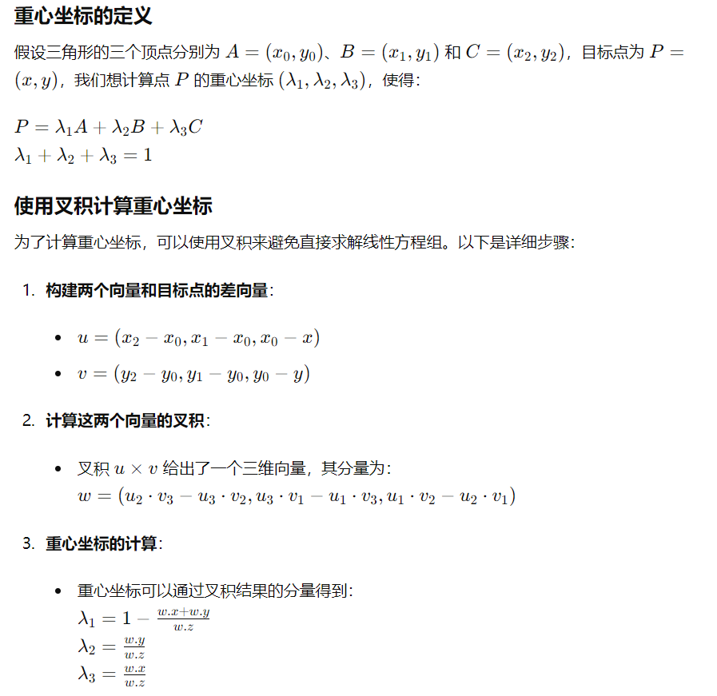

### 三角形光栅化

#### 重心坐标的计算



```c++
Vec3f barycentric(Vec2i* pts, Vec2i p) {
    Vec3f u = Vec3f(pts[2][0] - pts[0][0], pts[1][0] - pts[0][0], pts[0][0] - p[0]) ^
                Vec3f(pts[2][1] - pts[0][1], pts[1][1] - pts[0][1], pts[0][1] - p[1]);//重心坐标的计算有公式
    if (std::abs(u.z) < 1) return Vec3f(-1, 1, 1);
    return Vec3f(1 - (u.x + u.y) / u.z, u.y / u.z, u.x / u.z);
}
```

#### 包围盒的计算

简单的思想，实际上就是找一个三角形的左下角和右上角顶点来确定包围盒范围。

```c++
void triangle(Vec2i* pts, TGAImage& image, TGAColor color) {
    Vec2i bboxmin(image.get_width() - 1, image.get_height() - 1);
    Vec2i bboxmax(0, 0);
    Vec2i clamp(image.get_width() - 1, image.get_height() - 1);
    //确定包围盒的范围
    for (int i = 0; i < 3; i++) {
        bboxmin.x = std::max(0, std::min(bboxmin.x, pts[i].x));
        bboxmin.y = std::max(0, std::min(bboxmin.y, pts[i].y));
        bboxmax.x = std::min(clamp.x, std::max(bboxmax.x, pts[i].x));
        bboxmax.y = std::min(clamp.y, std::max(bboxmax.y, pts[i].y));
    }
    Vec2i p;
    for (p.x = bboxmin.x; p.x <= bboxmax.x; p.x++) {
        for (p.y = bboxmin.y; p.y <= bboxmax.y; p.y++) {
            Vec3f bc = barycentric(pts, p);
            if (bc.x < 0 || bc.y < 0 || bc.z < 0) continue;
            image.set(p.x, p.y, color);
        }
    }
}
```

