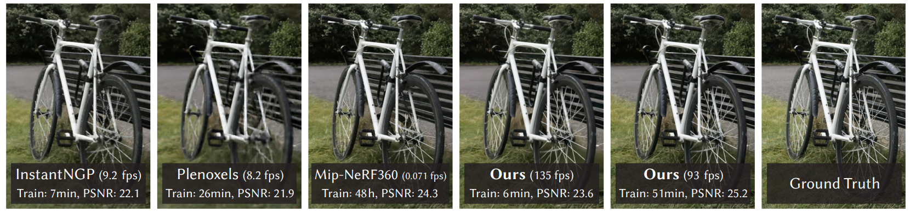
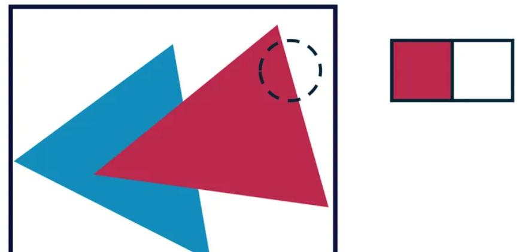
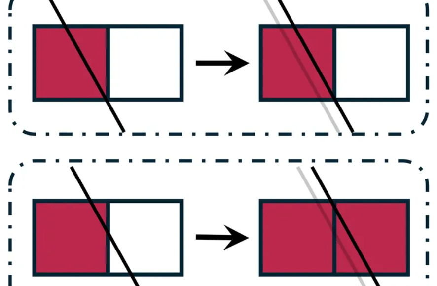
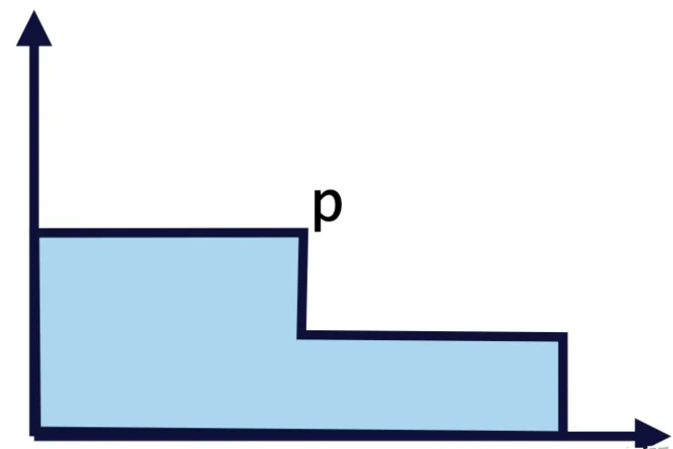

# 可微渲染学习

SIGGRAPH 2023 best paper：3D Gaussian Splatting for Real-Time Radiance Field Rendering

论文主页：https://repo-sam.inria.fr/fungraph/3d-gaussian-splatting/

现在3DGS大火，关注计算机视觉和图形学的朋友肯定早就听到了Gaussian Splatting的大名。这几天我也在看3DGS相关的博客，想快速入门一下。但是我发现自己对于可微渲染中的“可微”理解还不够透彻，于是又学习了可微渲染的概念。下面我以零基础的视角来讲讲我的理解。

##### 首先，3DGS是干啥的

一言以蔽之：3D Gaussian Splatting提出了一种三维表达（3D Gaussians）和配套的渲染方式（Splatting），能够做到：

1.迅速地重建现实世界中的场景 

2.用重建的场景渲染新视角图片，速度特别快（实时渲染，可达100+FPS) 

3.用重建的场景渲染新视角图片，看起来特别真实（超越了之前一众的方法）

给定一个公园自行车场景的多视角图片，用不同的方法重建该场景，并实时渲染一段视频。其中135 FPS代表3DGS单次渲染很快，Train: 6min代表根据输入图片重建场景的过程很快，PSNR:23.6代表重建精度（真实感）很高。实时渲染的能力来自于对渲染过程的优化，本文不会过多深入；而“快速精准重建”的能力，来自于可微渲染——3DGS是一套高效的渲染框架，更是一套高效的可微渲染框架。

##### 对于可微渲染的理解

考虑一个通用的渲染过程：我们有一堆原料——物体（形状、材质、位置）和光照，将它们统一写作x；还有一个渲染器，它写作一个从“原料空间”到“图片空间”的函数 f 。那么任何一个正向渲染过程，就是根据原料，使用渲染器，求得一张图片（记为 y ）的过程，即y=f(x)。

逆渲染是这个过程的逆过程，给定一张图片 y′ ，逆渲染希望通过某种手段，求出其对应的“原料”，这个目标可以写作x′=f^(−1)(y′) 。现实中，渲染过程的逆过程非常难以表达，如何想象光栅化的逆过程？但好在我们的目的并不是求出逆过程的表达式，而是用某种手段推测出 x′ ，这只需要一个更松弛的条件—— dy/dx，有了它，我们就能用梯度下降等方式，不求逆过程表达式，一样能推测出正确的 x′ 。

到这里，相信读者也明白这里的某种手段是什么了，就是可微渲染！所谓可微渲染，指的就是这样一类正向渲染方法：其产生的图片对产生它的“原料”是可微的。更具体一点，就是指当某个“原料”的值（物体或光照）变化一点点时，能够知道图片上任何一个像素的颜色变化了多少，朝什么颜色变化。可微渲染是通往逆渲染的可能途径，但这是条很不简单的途径，下面来介绍一下可微渲染的核心问题：不连续。想象一个简单的场景：两个三角形被渲染到了一张图片上，不考虑光照/shading，每个像素简单获得其对应的三角面颜色，那么这张图会像这样：

对于其中的每一个像素颜色，显然它与三角面颜色的映射关系不难建立：当三角面颜色变化一点时，与之对应的像素颜色都会发生对应的变化，在这个例子里，因为每个像素直接获取了三角面上的颜色，所以二者是相等的关系。我们当然可以通过梯度下降优化三角面颜色， 如果我们加入材质贴图，就能获得更强的表达能力，可以优化出各种图案。一切似乎很简单，但是如果我们考虑优化这两个三角面的位置呢？那我们需要知道，当三角形的位置移动一点时，每个像素的颜色应该怎么变，变多少。这真的可能吗？我的意思是，导数真的存在吗？当三角形的位置移动一点时，像素的变化真的是连续的吗？在这张图上，并不是！考察三角形的边缘，我们放大一点来看，只看两个像素：

当球向右移动一个极小量时，有两种可能：

也就是说，对于右边这个像素来说，三角形向右的移动量-颜色的函数是这样：

这里我们用横轴代表向右移动量，p代表临界位置，在p前颜色是白色，在p后突变为红色。显然这个函数的导数在大部分位置是0，在其他所有位置上都不存在！也就是说，当这个三角形移动一点点时，我们不知道它的边缘上像素的颜色变化应该是多少，因为这个数字要么是0，要么不存在！现在，相信大家也明白了可微渲染的核心问题，那就是位置“不可微”。

至此，我们可以说可微渲染是一个可以微分求导的渲染过程, 它的正向是渲染, 逆向是求像素对场景参数的微分。由于传统的渲染不可微, 难以设计基于优化和基于深度学习神经网络的逆渲染方法, 可微渲染技术的提出大大地增加了这些方法的设计空间。

可微渲染正向过程和传统渲染相同, 输入模型和参数得到一张图片, 逆向是像素对场景参数求导数, 可微渲染需要兼具这两个过程, 不仅需要得到渲染结果, 还要得到渲染结果对输入的导数。可微渲染不能离开传统的渲染模型, 但传统的渲染方法不可微, 所以可微渲染往往是基于某种传统渲染模型, 通过引入新的技术, 使得我们可以得到渲染结果对输入的导数。

后续我会继续学习可微渲染的主流方法...