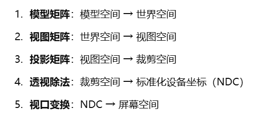
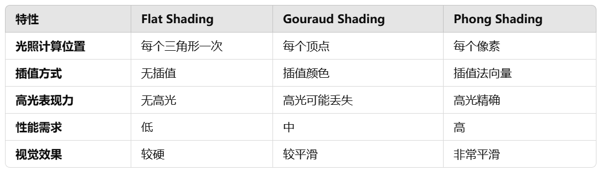
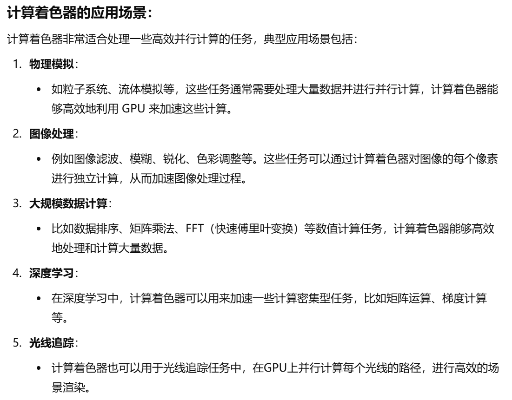
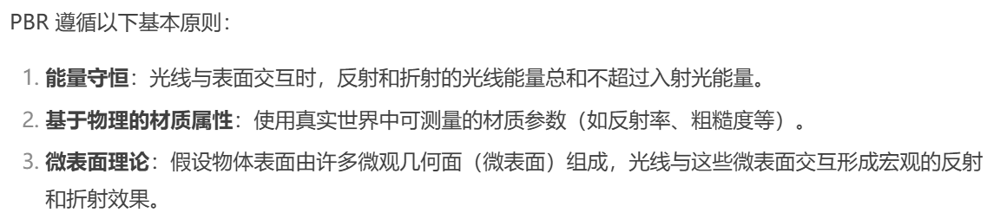
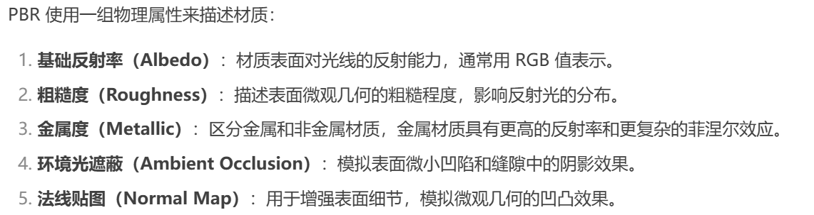
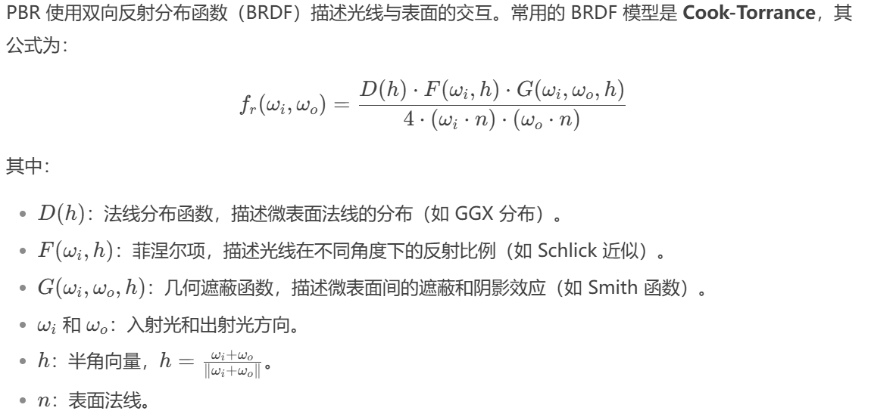
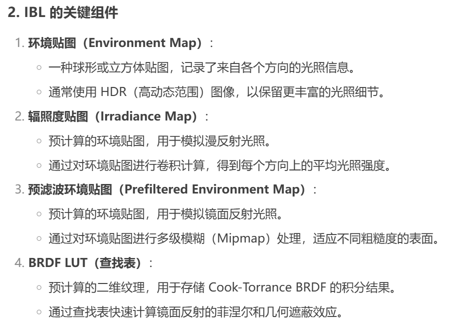
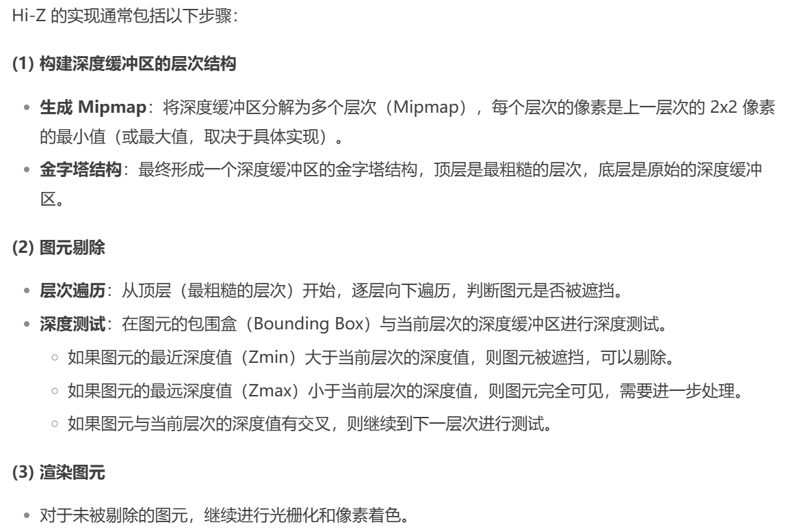

#### 物体从模型空间到最终显示在屏幕上经过了哪些变换？

#### 常用的阴影算法原理

**1.Shadow Map（阴影贴图）**

从光源视角渲染场景，将每个像素的深度值存储在阴影贴图中（Shadow Map）。在实际渲染时，将屏幕空间点重投影到光源空间，计算该点的深度值并与阴影贴图中的深度值比较，如果当前点的深度大于阴影贴图中的深度值，则该点位于阴影中。

优点：

- 易于实现，兼容多种光源（点光源、方向光源、聚光灯）。
- 性能较高，可适用于实时渲染。

缺点：

- 锯齿问题：由于分辨率有限，阴影边缘容易出现锯齿。
- 自遮挡问题：物体表面可能错误地认为自己遮挡了自身。

**2.PCF（Percentage Closer Filtering）**

基于 Shadow Map 算法，通过对阴影贴图中的多个深度值采样，计算当前像素被遮挡的可能性，对每个采样点比较深度值，统计落在阴影中的比例，根据遮挡比例对阴影强度进行插值，生成柔和的阴影边缘。在阴影贴图中，围绕当前像素采样一个小范围的像素，对每个采样点执行深度测试，将被遮挡的采样点比例作为当前像素的阴影因子。

优点：

- 能够缓解 Shadow Map 的锯齿问题，阴影边缘更加平滑。
- 算法简单，对硬件友好。

缺点：

- 采样数量直接影响性能和阴影质量，采样过少会导致明显的边缘分块。
- 对于不同光源的阴影软硬程度无法真实模拟。

**3.PCSS（Percentage Closer Soft Shadows）**

改进自 PCF，通过模拟光源大小和遮挡物的距离，实现柔和的阴影过渡。计算光源到遮挡物的距离，动态调整采样范围，模拟阴影边缘的软硬过渡。离光源近的阴影边缘锐利，离光源远的阴影边缘更加模糊。PCSS 通过分析多个邻近像素的深度值来模糊阴影边缘，模糊的程度取决于光源的大小和阴影的距离。光源越大，阴影的边缘越柔和，距离光源较远的地方阴影也更软。

**4.Cascaded Shadow Maps (CSM)**

CSM 是一种用于解决远景阴影精度问题的技术。它通过将视锥体分成多个区域，并在每个区域使用不同分辨率的阴影贴图来提供精细的阴影细节，从而在保持较高阴影质量的同时，优化性能。CSM 通过将视锥分为多个“级联”（Cascades），每个级联有一个独立的阴影贴图。近处使用较高分辨率的阴影贴图，以提供高质量的阴影，而远处则使用低分辨率的阴影贴图，从而减少计算量并保持性能。

**CSM 与 PCSS 的关系**

CSM 和 PCSS 虽然是不同的技术，但可以结合使用以在大世界场景中提供更高质量的阴影效果：

1. CSM 解决精度问题：CSM 主要用于改善远景阴影的分辨率问题，确保阴影在不同距离的区域都能有适当的细节表现。通过多个级联和不同分辨率的阴影贴图，CSM 确保了整个视锥体内阴影的表现更加清晰和精确。
2. PCSS 解决阴影柔化问题：虽然 CSM 可以提供更精细的阴影贴图，但它仍然可能在阴影的边缘产生硬边。在这种情况下，PCSS 可以用来对 CSM 生成的阴影边缘进行软化处理，使阴影更加自然。PCSS 通过分析深度信息，模糊阴影的边缘，并根据光源大小调整模糊度，从而生成柔和的阴影过渡。

#### 图形渲染管线概述

图形渲染管线实际上指的是一堆原始图形数据途经一个输送管道，期间经过各种变化处理最终出现在屏幕的过程，在概念上可以将图形渲染管线分为四个阶段：**应用程序阶段、几何阶段、光栅化阶段和像素处理阶段**。

应用程序阶段的主要任务是可见性判断、控制着色器参数和渲染状态、提交图元至GPU硬件以供渲染。

几何阶段主要负责大部分多边形操作和顶点操作，将三维空间的数据转换为二维空间的数据，可以分为顶点着色、投影变换、裁剪和屏幕映射阶段。

光栅化阶段是将图元离散化成片段的过程，其任务是找到需要绘制出的所有片段，包括三角形设置(图元装配)和三角形遍历阶段。

像素处理阶段给每一个像素正确着色，最后绘制出整幅图像，包括像素着色和合并阶段。

#### 图形渲染管线详述

**1.应用程序阶段**

该阶段主要是在CPU上执行的一些工作，包括空间加速算法、视锥剔除、碰撞检测、动画物理模拟等。大体逻辑是：执行视锥剔除，查询出可能需要绘制的图元并生成渲染数据，设置渲染状态和绑定各种Shader参数，调用DrawCall，进入到下一个阶段，GPU渲染管线。

**2.几何阶段**

包含顶点着色、投影变换、裁剪和屏幕映射阶段。

顶点处理阶段：这个阶段会执行**顶点变换**和**顶点着色**的工作。通过模型矩阵、观察矩阵和投影矩阵(也就是MVP矩阵)计算出顶点在裁剪空间下的位置(clip space)，以便后续阶段转化为标准化设备坐标系(NDC)下的位置。也可能会计算出顶点的法线(需要有法线变换矩阵)和纹理坐标等。同时，在这个阶段也可能会进行简单的顶点着色计算，如平面着色 (Flat Shading)和高洛德着色 (Gouraud Shading)都是在顶点着色器中进行着色计算（如果需要在像素级别进行更复杂的着色，例如Phong着色或者更高级的像素着色技术，那么相关的计算会在像素着色阶段完成）。因为这个阶段是完全可控制的，因此执行什么样的操作由程序员来决定。在顶点处理阶段还有一些可选的阶段，包括曲面细分(tessellation)、几何着色(geometry shading)等。

**裁剪阶段：**对不在视锥体内部的顶点进行裁剪（在几何阶段中，裁剪主要指的是**图元裁剪**，即检查由顶点组成的图元是否在**视锥体（View Frustum）内**。如果图元完全位于视锥体外，则直接剔除；如果部分位于视锥体外，则计算图元与视锥体边界的交点，生成新的顶点和图元。这一裁剪操作发生在投影变换之后，目的是减少后续光栅化阶段的计算量。这部分是几乎完全由硬件控制的。问：为什么在几何阶段中已经包含了视锥体剔除功能的情况下还需要应用程序阶段的视锥体裁剪？简单来说就是两次裁剪的粒度不同，应用程序阶段的视锥体裁剪是在物体对象层面的，一般对对象的包围盒做剔除，剔除掉不在视锥体内的物体，几何阶段的视锥体裁剪是在顶点或图元级别进行，处理部分可见的图元，确保后续的光栅化操作只处理有效区域。

**屏幕映射阶段：**主要目的是将之前步骤得到的坐标映射到对应的屏幕坐标系上。

**3.光栅化阶段**

包含三角形设置和三角形遍历阶段。这两个阶段是完全硬件控制的，不可进行任何操作。

**三角形设置(图元装配)**，这个过程做的工作就是把顶点数据收集并组装为简单的基本体（线、点或三角形），计算出三角形的一些重要数据(如三条边的方程、深度值等)以供三角形遍历阶段使用，这些数据同样可用于各种着色数据的插值。

**三角形遍历**，找到哪些像素被三角形所覆盖，并对这些像素的属性值进行插值。这个过程将检验屏幕上的某个像素是否被一个三角形网格所覆盖，被覆盖的区域将生成一个片元（Fragment）。片元不是真正意义上的像素，而是包含了很多种状态的集合（如屏幕坐标、深度、法线、纹理等），这些状态用于最终计算出每个像素的颜色。这一阶段包括抗锯齿（Anti-aliasing）操作，因为不管用什么划分片元的方法，三角形边缘部分总会显得很锐利。除此以外，GPU还将对覆盖区域的每个像素的深度进行插值计算。因为对于屏幕上的一个像素来说，它可能有着多个三角形的重叠，所以这一步对于后面计算遮挡、半透明等效果有着重要的作用。

**4.像素处理阶段**

包括像素着色和测试合并。

**像素着色，**进行光照计算和阴影处理，决定屏幕像素的最终颜色。各种复杂的着色模型、光照计算都是在这个阶段完成。

**测试合并，**包括各种测试和混合操作，如裁剪测试（到了像素处理阶段的“裁剪测试”指的是**片元级别的裁剪**，裁剪粒度是像素级，它与几何阶段的裁剪有所不同，通常也称为**视口裁剪**或**屏幕空间裁剪**）、透明测试、模板测试、深度测试以及色彩混合等。经过了测试合并阶段，并存到帧缓冲中的像素值，才是最终呈现在屏幕上的图像。

#### 着色方式的区别，Flat Shading、Gouraud-shading和Phong-Shading？

**1.Flat Shading**

- 光照计算位置: 每个三角形的一个顶点或三角形的法向量（通常是**面法向量**）。
- 颜色插值方式: **无插值，整个三角形使用单一颜色。**
- 优点:
  - 计算简单，性能高。
  - 能清晰展现多边形的形状和边界。
- 缺点:
  - 光照变化不平滑，看起来很“硬”或“块状”。
  - 不适合表现光滑的曲面。

 **2.Gouraud Shading**

- 光照计算位置: 在顶点处进行计算，使用**顶点法向量**。
- 颜色插值方式: **基于顶点颜色，通过线性插值计算像素颜色。**
- 优点:
  - 渲染结果比Flat Shading更平滑。
  - 性能较高，因为光照计算仅发生在顶点处。
- 缺点:
  - 高光部分可能被插值稀释，导致无法正确表现高光效果。
  - 对于细节复杂的光照效果表现力不足。

**3.Phong Shading**

- 光照计算位置: 在**每个像素**进行计算，使用**插值法向量**。
- 颜色插值方式: **不插值颜色，而是插值法向量并在像素级别重新计算光照。**
- 优点:
  - 渲染结果非常平滑，细节丰富。
  - 能更好地表现高光、曲面等复杂光照效果。
- 缺点:
  - 计算量较大，性能要求更高。

#### 延迟渲染

延迟渲染（Deferred Rendering）主要用于提高复杂场景中多个光源的渲染效率，尤其在实时渲染中当场景中的光源数量较多时，延迟渲染能够显著优化性能。正向渲染对每一个需要渲染的物体，程序都要对每个光源下每一个需要渲染的片段进行迭代，如果旧的片段完全被一些新的片段覆盖，最终无需显示出来，那么其着色计算花费的时间就完全浪费掉了。可以将延迟渲染理解为先将所有物体都先绘制到屏幕空间的缓冲（即G-buffer）中，再逐光源对该缓冲进行着色的过程，从而避免了计算那些被深度测试丢弃的片元的着色而产⽣的不必要的开销。也就是说延迟渲染基本思想是，先执行深度测试，再进行着色计算（导致延迟渲染不支持透明物体渲染，因为先进行了深度测试再着色，而前向渲染是先着色再深度测试）。与传统的前向渲染（Forward Rendering）不同，延迟渲染的关键思想是将渲染过程分为两个阶段：第一阶段是几何阶段，第二阶段是光照阶段。

在几何阶段，延迟渲染不直接计算光照，而是将所有物体的几何属性绘制到G-buffer中，包括颜色、法线、深度、材质等信息，为后续的光照计算做好准备。处理复杂度与屏幕分辨率直接相关，因为每个像素都需要填充数据。G-buffer的建立使得场景中的所有光源信息与物体的几何信息分开，这为后续阶段的光照计算提供了便利。

在光照阶段，遍历所有光源，并对每个光源进行光照计算。光照计算是在屏幕空间进行的，而不是对整个场景的所有几何体逐顶点计算，每个光源只会影响它的影响范围内的像素（例如一个点光源可能只影响附近的像素）。由于所有的几何信息已经存储在G-buffer中，光照计算不再需要访问场景中的几何数据，而是直接从G-buffer中提取所需的属性，基于像素的法线、深度和材质信息来计算每个像素的最终光照。屏幕空间虽然是二维的，但 G-Buffer 中存储的信息提供了还原三维空间信息的关键数据，虽然光照计算发生在屏幕空间，但实际上是在利用三维空间中的几何信息进行计算。由于每个像素的几何信息已经预先存储，因此对每个光源的计算变得独立且高效，避免了传统渲染方法中每次渲染时都要对每个光源进行计算的重复工作。光照阶段的输出通常是最终的颜色值，这些值会与其他渲染效果（如透明度、阴影、后处理效果等）合成，形成最终的图像。

此外，延迟渲染还提供了更高的灵活性，因为它可以轻松地在光照计算时加入后处理效果、全局光照、反射等效果。延迟渲染缺点是它对显存和带宽的要求较高，因为需要存储大量的G-buffer数据。延迟渲染通常不支持透明物体的正确渲染（因为透明物体无法直接在G-buffer中记录所有相关信息），因此在处理透明度时，往往需要结合传统的前向渲染进行处理。

#### Compute Shader

**Compute Shader（计算着色器）** 是一种专门用于通用计算任务的着色器，它是图形管线之外的一种并行计算方式，允许开发者利用 GPU 强大的计算能力进行非图形的计算任务。计算着色器与传统的渲染管线（顶点着色器、片段着色器等）不同，它不直接用于图形渲染，而是专门用于通用计算，例如物理模拟、图像处理、数据排序、计算流体力学等任务。与顶点着色器或片段着色器不同，计算着色器不直接操作图像的输出，而是处理数据并将结果存储到缓冲区或纹理中，后续的操作可以通过其他着色器来使用这些结果。计算着色器允许直接访问和操作 GPU 的内存资源（例如缓冲区、纹理等），并且能够高效地读写这些数据。

#### 顶点着色器

**顶点着色器的输入？**

顶点着色器（Vertex Shader）是图形渲染管线中的第一个可编程阶段，其主要作用是处理顶点数据，并将其转换到裁剪空间，为后续的渲染阶段做准备。顶点着色器的输入通常包括顶点属性数据（如位置、法线、纹理坐标、颜色等）以及一些额外的上下文数据（如常量或传递给着色器的统一变量）。

#### PBR和IBL

PBR（Physically Based Rendering，基于物理的渲染）是一种基于物理定律的渲染技术，通过微表面理论、能量守恒和物理材质属性，生成高度逼真的图像。其核心在于 Cook-Torrance BRDF 模型，结合 IBL 等技术，能够模拟复杂的光照效果。

PBR强调光与物体的交互要符合物理规律，IBL（Image Based Lighting，基于图像的光照）为渲染场景提供真实的环境光照。IBL是一种利用环境贴图（Environment Map）模拟全局光照的技术，通过捕捉真实世界的光照信息并将其应用到渲染场景中，从而实现高度逼真的光照效果。IBL 是 PBR的重要组成部分，能够显著增强渲染的真实感和沉浸感。IBL 的核心思想是利用环境贴图（通常是 HDR 图像）作为光源，模拟场景中的全局光照。环境贴图记录了来自各个方向的光照信息，可以用于计算漫反射、镜面反射和环境光遮蔽等效果。

通过存储每个cubemap像素卷积的结果，辐照度图有点像环境的平均颜色或光照显示。从辐照度图采样任意方向，可获得这个方向的场景辐照度。

#### Early-Z和**Hierarchical-Z**

**Early-Z** 是图形渲染管线中的一种优化技术，通过提前进行深度测试（Depth Test）来减少不必要的像素着色计算，从而提高渲染性能。在传统的图形渲染管线中，深度测试（Z-Test）通常在像素着色阶段之后进行，即：

1. **像素着色**：对每个像素片段执行着色计算（如光照、纹理采样等）。
2. **深度测试**：比较当前像素片段的深度值与深度缓冲区中的值，决定是否保留该像素。
3. **颜色写入**：通过深度测试的像素将其颜色值写入帧缓冲区。

这种流程的问题在于，**即使某些像素最终会被深度测试丢弃，仍然会执行昂贵的像素着色计算**，导致性能浪费。Early-Z 的核心思想是**将深度测试提前到像素着色阶段之前**，从而避免对不可见像素进行不必要的着色计算，即：

1. **光栅化**：将图元转换为像素片段。
2. **Early-Z 测试**：在像素着色之前，对每个像素片段进行深度测试。
   - 如果像素片段未通过深度测试，则直接丢弃，跳过像素着色阶段。
   - 如果像素片段通过深度测试，则继续执行像素着色。
3. **像素着色**：对通过 Early-Z 测试的像素片段执行着色计算。
4. **最终深度测试**：在像素着色后，再次进行深度测试（可选，用于处理某些特殊情况）。
5. **颜色写入**：通过深度测试的像素将其颜色值写入帧缓冲区。

Early-Z 的缺点：透明物体通常需要混合（Blending）操作，而混合依赖于像素着色结果，因此 Early-Z 无法提前丢弃透明像素。

**Hierarchical-Z（Hi-Z）** 是一种基于深度缓冲区的优化技术，用于在图形渲染中快速剔除被遮挡的图元（如三角形），从而减少不必要的渲染计算。Hi-Z 通过构建深度缓冲区的层次结构（Mipmap 或金字塔结构），在粗粒度级别上快速判断图元是否被遮挡，从而提高渲染性能。

#### 深度缓冲，解释一下透明物体需要记录Z值吗？
